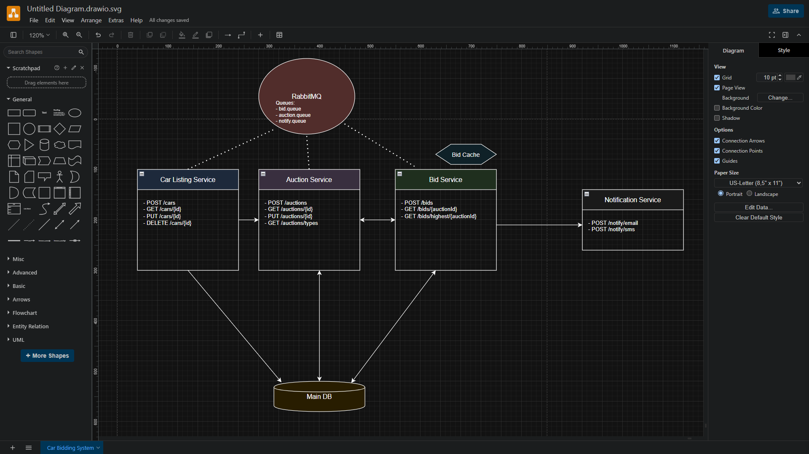

# BiddingSys
Online Bidding System for Automobiles

# What?
An online bidding system. 
Users can Buy & Sell cars.

# How?

### Organized :
    1. 3 different micro services ( AuctionService, BidService and SupportService )
    2. Each one of the 3 to be converted and deployed as containerized microservices
    3. Common shared dB for all 3 micro services
    4. Micro Services communicate with each other through REST APIs and event-driven.
  
### Tech stack :
    1. ASP.NET Core Minimal API with .NET 8 Runtime
    2. RabbitMQ for handling messaging
    3. Dockerized SQL Server 2019
    4. K6 Load testing to be added

# Design

    
# Info :
Have not considered to have an UI. 
Focussed only on Back-end Design and implementation
Used REST and HTTP. ( ideally I should have used gRPC, but due to the lack of time to code, REST was chosen)

